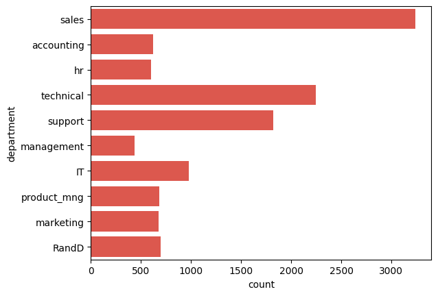
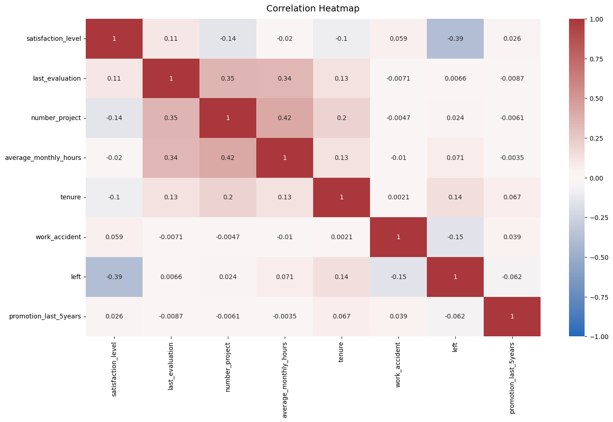

 # **Capstone project: Providing data-driven suggestions for HR**   

### Plan Stage

#### Business scenario and problem

The HR department at Salifort Motors wants to take some initiatives to improve employee satisfaction levels at the company. They collected data from employees, but now they don’t know what to do with it. The main question given to resolve is: **What’s likely to make the employee leave the company?**

My goals in this project are to analyze the data collected by the HR department and to build a model that predicts whether or not an employee will leave the company.

I will need to predict why employees are likely to quit; it might be possible to identify factors that contribute to their leaving. Because it is time-consuming and expensive to find, interview, and hire new employees, increasing employee retention will be beneficial to the company.

The dataset that used in this capstone contains 15,000 rows and 10 columns for the variables listed below. 

**Note:** The dataset source was downloaded from [Kaggle](https://www.kaggle.com/datasets/mfaisalqureshi/hr-analytics-and-job-prediction?select=HR_comma_sep.csv).

Variable  |Description |
-----|-----|
satisfaction_level|Employee-reported job satisfaction level [0&ndash;1]|
last_evaluation|Score of employee's last performance review [0&ndash;1]|
number_project|Number of projects employee contributes to|
average_monthly_hours|Average number of hours employee worked per month|
time_spend_company|How long the employee has been with the company (years)
Work_accident|Whether or not the employee experienced an accident while at work
left|Whether or not the employee left the company
promotion_last_5years|Whether or not the employee was promoted in the last 5 years
Department|The employee's department
salary|The employee's salary (U.S. dollars)

1. The main stakeholders are Salifort’s senior leadership team and the Human Resources department.
2. Analyze the survey data taken by employees and come up with ideas for how to increase employee retention. 
3. Employees from the Sales department were the most that took the survey out of 10 departments in the company.
4. Used Excel Pivot Table for a first glance of the data, and then used the dataset in Visual Studio Code for all EDA, Construct, and Execute phase.
5. Given this dataset was provided by Coursera and created for a fictional company, it can be assumed it reliability and originality.

-------------------------------------------------------------------------------------------------------------
### Analyze Stage 
Summary of EDA performed:
1. Removed duplicates
2. Check for outliers: tenure column had 824 rows
3. The satisfactory level column ranges from 0.09 to 1.0.
4. The tenure column ranges from 2 to 10 years, with a median of 3 years.
5. Some columns had mix of upperclass letters which were all converted to lowercase. The column orginally called 'time_spend_company' was changed to 'tenure' for simple and concise name.
6. EDA process:  
    a. Get more understanding of employees staying vs leaving the company.  
    b. Create data visualizations to evaluate relationships between independent and dependent variables.
7. Results indicate that 16% of employees left while 83% of employees stayed at the company.

Total of surveys submitted by Department

Correlation Heatmap

The heatmap above shows that the employees that left the company correlated negatively with satisfaction_level. Meanwhile, the number of projects, average monthly hours and  evaluation scores had a positive correlation with each other. 

### Construct Stage
1. Independent variable chosen were: 'satisfaction_level', 'last_evaluation', 'number_project', 'average_monthly_hours', 'tenure'.  
2. Variables departments and salary were converted into categorical variables in order to be included into the models.  
3. the task in hand is to predict what can make an employee stay or leave the company. The variable called left 
3. Machine Learning algorithms performed: 
- Tree Based Model 
- Random Forest Model 
- Logistic Regression Model

4. Logistic Regression Model results: the classification report achieved a precision of 81%, recall of 84%, f1-score of 81% all in weighted averages. But the predicted employees who would leave resulted in significantly lower (i.e 53%, 25%, and 34% respectively).

5. Using all variables, the Decision Tree Model resulted in a strong AUC score of 97.5%, showing that this model can predict well if employees leave or not.
Table results of the Decision tree vs Random Forest Model
----------------------------------------------------------
            model  | precision|  recall  |     F1   | accuracy  |     auc
            -----|-----|
 decision tree cv  | 0.966878 | 0.918288 | 0.941941 | 0.981208  | 0.975895
 random forest cv  | 0.945895 | 0.912254 | 0.928698 |  0.97676  | 0.982177

6. The range of average monthly hours is from 96 to 310 hours. Approximately monthly hours of working is 166.67 for an employee  50 weeks a year, 5 days a week for 8 hours per day. It could be defined that overworking is > 175 hrs per month on average. 

### Execute Stage
1. The XGBoost model was the best-performing machine learning algorithm in predicting employees who stayed with the company.
2. Decision tree model had a strong performance to predict both true negative and true postives. 
3. Employee Sentiment and Surveys: Prediction models and employee surveys are valuable tools for employers to understand how their employees feel, ultimately helping to improve employee retention.
4. Working Hours and Overwork: The data results the range of working hours per month is from 90 to 310hr/mo. Exceeding 175 hours per month is considered overworking, suggesting that a better work-life balance and limits on working hours could boost job satisfaction.
5. Recognition and Morale: Implementing regular performance reviews and providing recognition for completed projects could significantly improve employee morale.
6. Future Survey Focus: To gain a more comprehensive understanding, future surveys should aim to increase participation from departments like management, IT, and marketing, which had lower response rates compared to sales and technical departments.

--------------------------------------------------------------------------------------------------------------
Find Stages in detail:
 Analyze Stage [Capstone Analyze Stage](https://github.com/Mvviggi/Salifort_Motors/blob/f91f7240a5f87f6ea9cca6af9c002b3e5d7f6be9/Salifort_Motors_Capstone_EDA.ipynb)  

 Construct Stage[Capstone Construct Stage](https://github.com/Mvviggi/Salifort_Motors/blob/f91f7240a5f87f6ea9cca6af9c002b3e5d7f6be9/Salifort%20Motors_Capstone_Construct.ipynb)  

 Execute Stage [Capstone Execute Stage](https://github.com/Mvviggi/Salifort_Motors/blob/f91f7240a5f87f6ea9cca6af9c002b3e5d7f6be9/Salifort_Motors_Capstone_Execute.ipynb)  